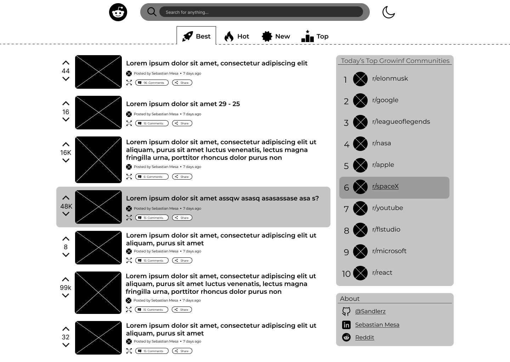
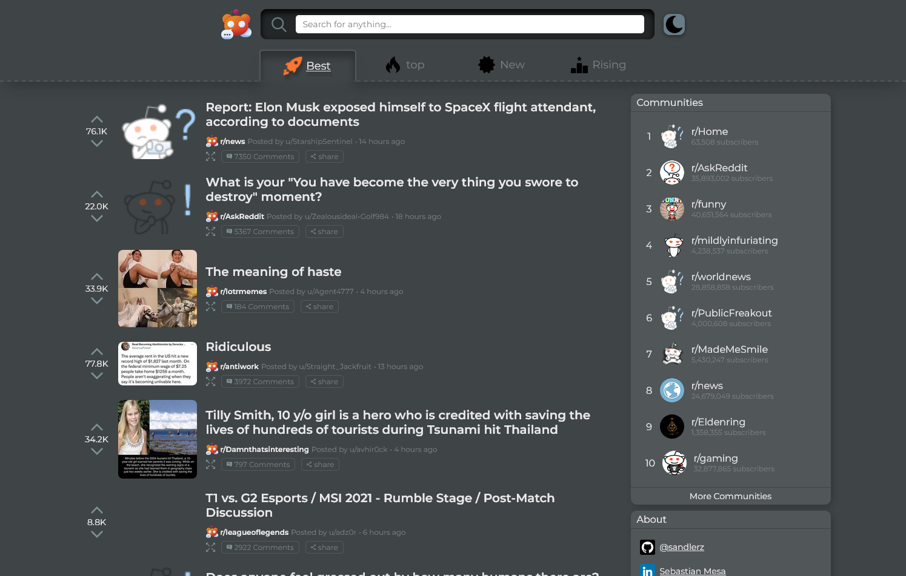

# Reddit-Little

## Table of Contents

- [General Information](#general-information)
- [Wireframes](#wireframes)
- [Screenshots](#screenshots)
- [Technologies Used](#technologies-used)
- [Features](#features)
- [Future work](#future-work)
- [Setup](#setup)

## General Information

it's an application that search to be a lite version of the famous site called [Reddit](https://www.reddit.com/)
the purpose of this project it's for that users that is looking for a minimal page of reddit

## Wireframes



## Screenshots



## Technologies used

- React
- React Router
- Redux
- Sass

## Features

- See the popular subreddits of the moment
- See the popular communities of the moment
- Search for specific topics or key world
- See comments of a specific subreddit
- Light mode enable

## Future work

- users can vote
- users can comment
- watch videos post

## Setup

To run this project, install it locally using npm:

Clone or download the repo then:

```
$ npm install
$ npm start
```
